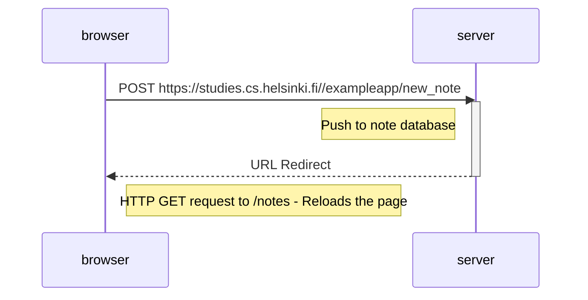
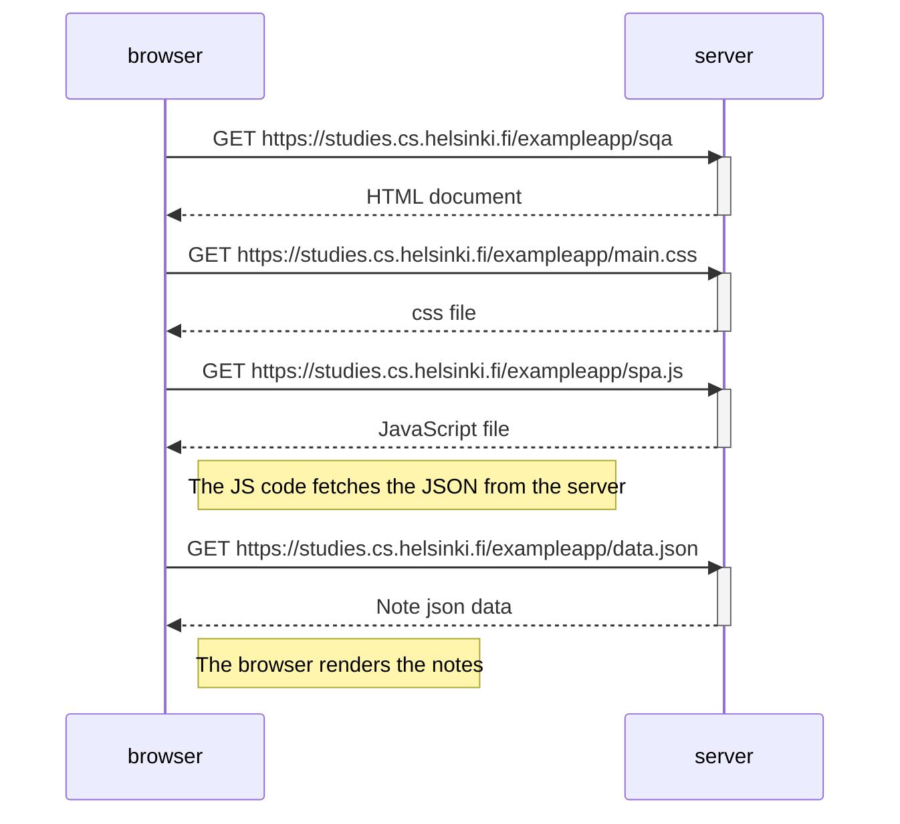
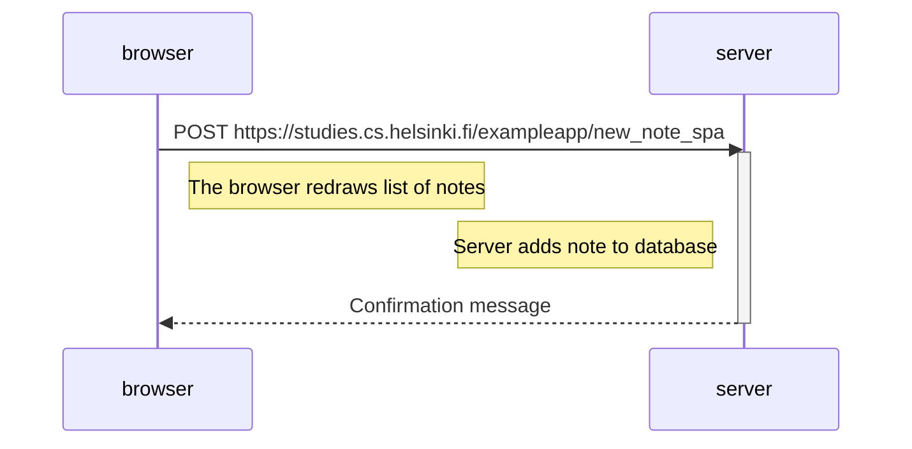

# Part 04

```mermaid
  sequenceDiagram
      participant browser
      participant server
  
      browser->>server: POST https://studies.cs.helsinki.fi//exampleapp/new_note
      activate server
      Note left of server: Push to note database
      server-->>browser: URL Redirect
      deactivate server
  
      Note right of browser: HTTP GET request to /notes - Reloads the page
```

# Part 05

```mermaid
  sequenceDiagram
    participant browser
    participant server

    browser->>server: GET https://studies.cs.helsinki.fi/exampleapp/sqa
    activate server
    server-->>browser: HTML document
    deactivate server

    browser->>server: GET https://studies.cs.helsinki.fi/exampleapp/main.css
    activate server
    server-->>browser: css file
    deactivate server

    browser->>server: GET https://studies.cs.helsinki.fi/exampleapp/spa.js
    activate server
    server-->>browser: JavaScript file
    deactivate server

    Note right of browser: The JS code fetches the JSON from the server

    browser->>server: GET https://studies.cs.helsinki.fi/exampleapp/data.json
    activate server
    server-->>browser: Note json data
    deactivate server

    Note right of browser: The browser renders the notes
```

# Part 06

```mermaid
  sequenceDiagram
    participant browser
    participant server

    browser->>server: POST https://studies.cs.helsinki.fi/exampleapp/new_note_spa
    activate server
    Note right of browser: The browser redraws list of notes
    Note left of server: Server adds note to database
    server-->>browser: Confirmation message
    deactivate server
```
